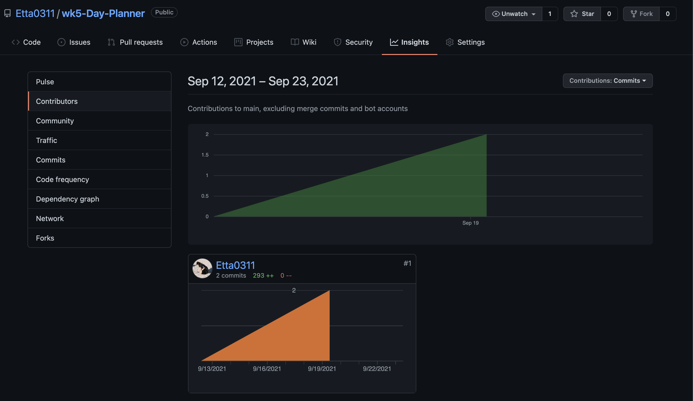

# wk5-Day-Planner

Link: [Work Planner](https://etta0311.github.io/wk4-CodeQuiz/)

## Description

Thhis work planner was built with starter code provided. Purpose of this planner is to make planner save the content to local storage, display them and also compare event time to current time which classify whether its past, present or future event. As the final product, planner will show what stored in local storage with a boackground colour showing the status.
this work is 100% created by my own and without copying others work.

## Table of Contents

   - Techniques used
   - Usage
   - Credits
   - License

## Techniques used

   - HTML
   - CSS
   - Javascript
   - jQuery 
   - Bootstrap

## Usage

## Contributors

## Credits
    - https://coding-boot-camp.github.io/full-stack/github/professional-readme-guid
    - https://choosealicense.com/
    - https://momentjs.com/docs/#/displaying/
    - https://www.yogihosting.com/jquery-selector/
    
## License
MIT License

Copyright (c) [2021] [Ettaho]

Permission is hereby granted, free of charge, to any person obtaining a copy
of this software and associated documentation files (the "Software"), to deal
in the Software without restriction, including without limitation the rights
to use, copy, modify, merge, publish, distribute, sublicense, and/or sell
copies of the Software, and to permit persons to whom the Software is
furnished to do so, subject to the following conditions:

The above copyright notice and this permission notice shall be included in all
copies or substantial portions of the Software.

THE SOFTWARE IS PROVIDED "AS IS", WITHOUT WARRANTY OF ANY KIND, EXPRESS OR
IMPLIED, INCLUDING BUT NOT LIMITED TO THE WARRANTIES OF MERCHANTABILITY,
FITNESS FOR A PARTICULAR PURPOSE AND NONINFRINGEMENT. IN NO EVENT SHALL THE
AUTHORS OR COPYRIGHT HOLDERS BE LIABLE FOR ANY CLAIM, DAMAGES OR OTHER
LIABILITY, WHETHER IN AN ACTION OF CONTRACT, TORT OR OTHERWISE, ARISING FROM,
OUT OF OR IN CONNECTION WITH THE SOFTWARE OR THE USE OR OTHER DEALINGS IN THE
SOFTWARE.
=======
